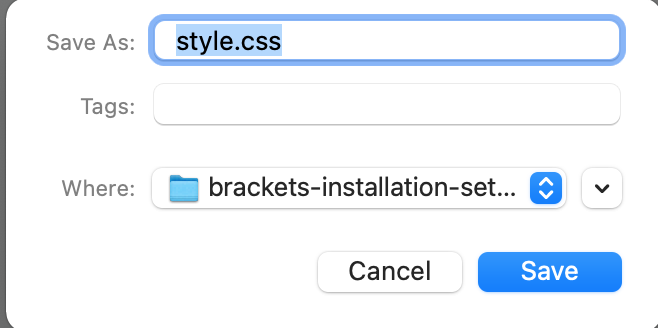
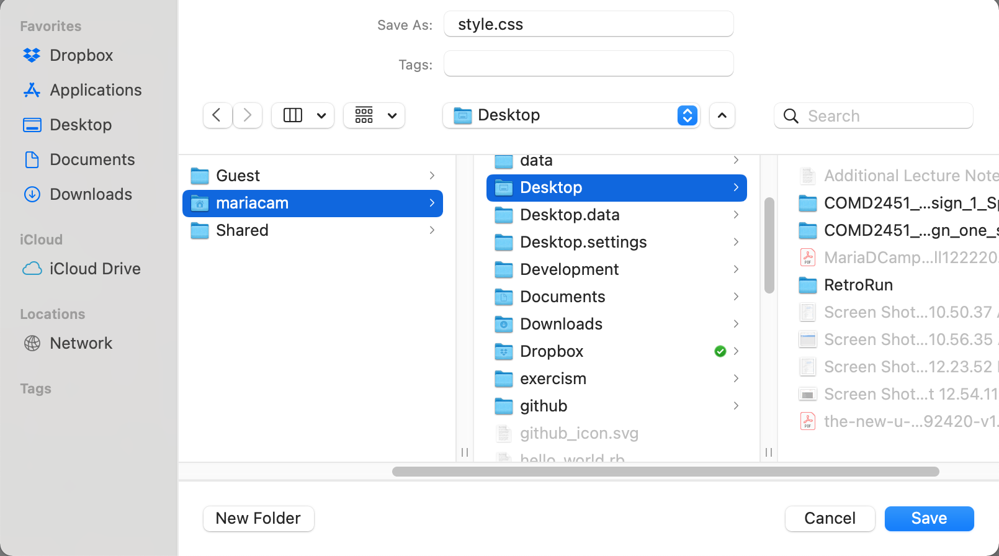
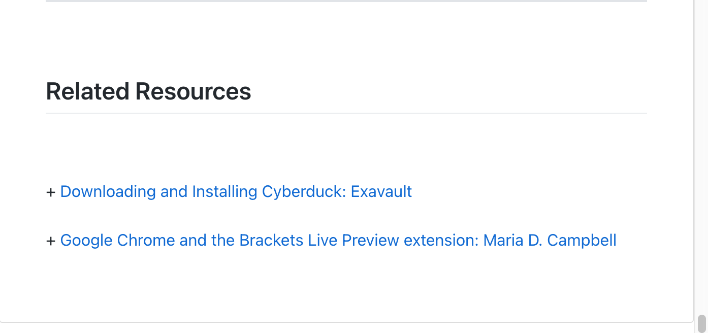

<h1 class="capitalize">COMD2451</h1>
<h2 class="capitalize center">Installing and Setting up Brackets</h2>

---

<section class="section">
    <h2 class="sentence">Installing The Brackets Code Editor</h2>

To ***install*** the `brackets` ***code editor***, go to [http://brackets.io/](http://brackets.io/) and ***click*** on the `Download Brackets 1.14.21` ***button***.

</section>

---

<section class="section">
    <h2 class="sentence">Finding Brackets on Your Mac</h2>

***Once*** you have ***finished installing*** `Brackets` on your ***computer***, go to your `Spotlight Search` and ***type*** in `Brackets`. It ***should*** `pop open` on your `computer screen` and ***take*** you to an ***introductory*** `html` ***file***. ***Look*** it ***over***, ***because*** we will ***study*** the `HTML` ***markup*** and ***structure*** there for a ***bit***.

</section>

---

<section class="section">
    <h2 class="sentence">Opening Brackets from inside a project folder in Terminal</h2>

***While*** the `Brackets` **code editor** is ***still*** open, ***select*** `File > Install Command Line Shortcut in Brackets`.

***When*** `Brackets` ***lets*** you ***know*** that the `shortcut` has been ***successfully installed***, you are ***good*** to ***go***!

</section>

---

<section class="section">
    <h2 class="sentence">The Brackets Command Line Shortcut</h2>

The `Brackets command line` ***shortcut*** is the ***following***:

```shell
brackets .
```

And the ***project*** you ***navigated*** to in `Terminal` will ***open*** in `Brackets`!

</section>

---

<section class="section">
    <h2 class="sentence">Opening a Project Folder from Brackets</h2>
    
If you would ***rather open*** a` project folder` from ***inside*** `Brackets` ***itself***,  ***select*** the `File` ***tab*** at the ***top*** of your `computer screen`, and ***scroll down*** to `open folder`. Then ***select*** the ***folder*** you **want** to ***open***, and ***then*** `click` on the `open` ***button***.

</section>

---

<section class="section">
    <h2 class="sentence">Opening a File from Brackets</h2>
    
To ***open*** a `file` from ***inside*** `Brackets` ***itself***, ***select*** the `File` ***tab*** at the ***top*** of your `computer screen`, and ***scroll down*** to `open`. ***When*** the `Finder` ***opens***, ***click*** on the `folder` which ***contains*** the `file` you ***want*** to ***open***, and then ***click*** the `file` you ***want*** to open ***inside*** that `folder`. Then ***click*** on the `open` ***button***.

</section>

---

<section class="section">
    <h2 class="sentence">Useful Brackets Extensions</h2>

+ `Beautify`: ***Format*** `JavaScript`, `HTML`, and `CSS` ***files*** and ***related*** languages.

+ `Brackets Color Picker`: This extension ***activates*** `color picker` for `brackets`, when you ***type*** `'color:'` in `brackets`, `color picker` will ***appear*** in the `editor`.

+ `Brackets Markdown Preview`: `Markdown` ***live preview*** incl. `detached window`, `code syntax highlighting`, `output themes`, `adaptive preview width`, `graphical checkboxes`, `activation` on ***start***.

+ `Brackets Prettier`: ***Format*** `JavaScript`, `HTML`, and `CSS` files and ***related*** languages.

+ `CSScomb`: ***Format*** `CSS` files with `csscomb.js`.

+ `CSSLint`: Adds `CSSLint` ***support*** to `Brackets`.

+ `Emmet`: ***High-speed*** `HTML` and `CSS` ***workflow***.

+ `HTML Skeleton`: Easily ***insert*** a ***variety*** of `HTML` elements ***into*** your `document`.

+ `HTML Wrapper`: Format `<ul>`, `<ol>`, `<nav>`, `<select>` and `<tr>` ***children*** tags with a ***single*** `command`. NOW with ***improved*** performance.

+ `HTMLHint`: Adds `HTMLHint` ***support*** to `Brackets`.

+ `Http Server for Brackets`: ***Launches*** an `http-server` ***module*** (http://127.0.0.1:8989) at `project root` and opens the ***selected*** file in a ***new*** browser tab.

+ `LiveReload`: `Brackets` ***extension*** for `LiveReload`, it can be ***used*** with `Chrome`, `Safari`, and `Firefox` ***LiveReload plugins***.

+ `Markdown Preview`: ***Live*** preview of `markdown` ***documents***.

+ `Markdown Toolbar`: `Toolbar` for writing ***documents*** in `Markdown`.

+ `Notes`: Easily ***add*** and manage ***notes***.

+ `SFtpUpload`: Upload ***changed*** files in your ***project*** to a `server` via `SFTP(SCP)/FTP`, you have ***total*** control over ***which*** to ***upload*** through the `changed files panel`.

+ `spell-check`: ***Spell checking*** the `Adobe Brackets Web Editor`.

+ `CodePen Panda Theme`: An ***exact*** replica of `CodePen.io`'s `Panda` ***theme***.

+ `Todo`: Display ***all*** `TODO` ***comments*** in current `document` or `project`.

</section>

---

<section class="section">
    <h2 class="sentence">How to create a new folder from inside Brackets</h2>
    
Let's say you ***wanted*** to ***create*** a ***new*** `folder` from ***inside*** the `Brackets` ***code editor*** `window`. ***Perhaps*** you ***need*** to ***create*** a `master folder` for ***all*** your `Web Design 1` ***course content*** on ***your*** `desktop`.

***First*** `create` a `folder` for the ***course*** on ***your*** `desktop`. ***Right-click*** on your `computer screen` which ***also represents*** your `desktop` on your `computer` and ***select*** `New Folder` ***from*** the `dropdown` that ***appears*** as a ***result***.

<div>
    
</div>

***When*** you ***select*** `New Folder` ***from*** the `dropdown`, it will ***create*** an `untitled folder` on the `desktop`. ***Click*** on `untitled folder` to ***rename*** it ***whatever*** you ***want***. For the ***sake*** of this ***demonstration*** and not to ***override*** any `folders` on ***my*** `desktop`, I will ***call*** this ***new folder*** `COMD2451_Web_Design_1_Sp21`.

***Next***, we ***need*** to ***create*** our ***new*** `file`. We'll ***start off*** with an `index.html file` ***which*** we ***will save*** into the ***newly created*** `COMD2451_Web_Design_1_Sp21` ***folder*** on our `desktop`.

In ***order*** to ***create*** a ***new*** `file` ***from within*** an ***active*** `Brackets` ***window***, we `right-click` on the ***left sidebar*** where the ***list*** of `project files` and `folders` are ***located***, and ***another*** `modal` ***pops up***.

<div>
    
</div>

***After*** we ***have selected*** the `New File` ***from*** the `dropdown`, `Untitled-1` will ***appear*** in the `left sidebar` of the `Brackets` ***window***.

***Now*** all we ***have*** to ***do*** is ***make*** the ***newly created*** `index.html` ***file*** the ***active*** `Brackets` ***window*** and then ***select*** the `File tab` ***from*** the `Brackets` ***navigation menu*** at the ***top*** of the ***computer screen***, and ***select*** `Save As` ***from*** the `File dropdown`. The ***following*** `modal` ***should appear***:

<div>
    
</div>

***However***, as you ***can see***, the ***folder*** which I ***wanted*** to ***target*** did ***not appear*** as an `option` in the ***modal***. ***However***, there is a `down arrow` ***button*** `located` to the ***right*** of the `Where:` ***select dropdown*** with a `folder` ***entitled*** `brackets-installation-setup` ***selected***. If we ***expand*** the ***view*** by ***clicking*** on the `down arrow` ***button***, the ***following*** `modal` will ***appear***:

<div>
    
</div>

Next, I have to select the correct folder to save my new index.html file in.

<div>
    
</div>

We ***have*** now ***selected*** the ***correct*** `folder` in ***which*** to ***save*** our `index.html` ***file*** (***ignore*** that I ***have*** a `style.css` ***file*** as the ***file*** to ***save*** to the ***targeted*** `folder` on the `desktop` as I ***already*** had an `index.html` file ***inside*** the `root` of my ***active*** `project folder`), ***all*** we ***have*** to ***do*** is ***click*** on the `Save` ***button***! The `index.html` ***file*** should ***now appear*** in the `COMD2451_Web_Design_1_Sp21` ***folder*** on my `desktop`.

</section>

---

<section class="section">
    <h2 class="sentence">Google Chrome and the Brackets Live Preview Extension</h2>
    
***When*** I ***started*** `using` the `Brackets` *`Live Preview`* ***extension*** using the ***default settings***, one morning I ***opened*** up my *`Google Chrome Preferences`* to ***view*** my `Chrome extensions`, and I ***found*** they were ***gone***!

I ***thought*** I was ***going*** to ***die***. I ***hadn't*** written ***what*** I was `using` ***down***, so I ***only remembered*** *`two crucial`* ***ones*** I `use` ***every day***, and ***re-installed*** them.

***Next thing***, I ***decided*** to ***upgrade*** to `OSX Big Sur`. ***After*** I ***installed*** it, and it *`re-booted`* my ***computer***, I ***opened*** up `Google Chrome` in ***order*** to ***surf*** the `Web`. ***Again***, I ***went*** into `Google Chrome Preferences` to ***check*** out ***which extensions*** would ***appear***. Guess what? They were ***all*** there.

I ***couldn't understand*** at ***first*** what was ***going on***, but I ***did not*** exit `Chrome`.

***Next*** thing, I ***found*** myself `using` the `Brackets Live Preview` ***extension***, which ***opened up*** the ***active*** `project` I was ***working on*** in `Google Chrome`. But ***guess what*** again? It ***opened*** a ***new*** and ***separate instance*** from my `web browsing` ***instance***. I had ***two*** `instances` of the `Google Chrome Web Browser` opened at the ***same time***. At ***this point*** I ***realized*** that it had ***something*** to ***do*** with the `Brackets Live Preview` ***extension***, but I ***didn't*** know ***why*** this `behavior` was ***taking*** place.

***After*** a ***tiny*** bit of ***research***, I ***found*** out ***what*** was ***going on***, ***why*** it was ***going on***, and ***how*** to ***prevent*** that `behavior` from ***persisting***. I ***ended*** up ***creating*** a `podcast` ***about*** it on my `anchor.fm` ***podcast*** entitled `Plugging in the Holes`, and ***from*** the `transcript` of ***that*** `podcast` I ***created*** a `post` on my [interglobalmedianetwork.com](https://www.interglobalmedianetwork.com/) ***website***. To ***read*** this ***post***, please ***visit*** [Google Chrome and the Brackets Live Preview extension](https://www.interglobalmedianetwork.com/blog/2021-02-06-google-chrome-and-the-brackets-live-preview-extension/). It is ***well worth*** the ***read***!

</section>

---

<section class="section">
    <h2 class="sentence">Fixing the Markdown Preview issue in Brackets</h2>
    
When I ***first*** started ***using*** `Markdown` in `Brackets`, I ***noticed*** that ***things like*** `unordered` or `ordered lists` did ***not*** `render` ***properly*** when `using` the `Markdown Preview Bracket` ***extension***. And I ***couldn't*** for the ***life*** of me ***figure out*** how to ***fix*** it!

But I was ***determined*** to `figure out` ***how*** to ***make*** my `Markdown` ***render properly*** in the `Preview`! It ***rendered properly*** in my `reveal-md` ***slide deck*** `hosted` on `http://localhost:1948`, and it ***rendered properly*** on the `Github repository`. So ***why*** wasn't it ***rendering properly*** in `Brackets Markdown Preview`??

***Simple really*** but ***not*** `intuitive`. ***According*** to the [MarkdownPreview Github repository](https://github.com/gruehle/MarkdownPreview) ***under*** the `Settings` ***section***,

> By default, the document is rendered as standard Markdown. Change the dropdown to "GitHub-Flavored (GFM)" to see the Markdown as it would appear in a GitHub issue, pull request, or comment.

The ***following*** is what I ***did*** in ***order*** to ***change*** the ***default*** `rendering` of *`Standard Markdown`* to *`"GitHub-Flavored (GFM)"`* to ***see*** what would ***happen***:

***First*** I ***went*** into a ***markdown file*** to ***preview*** with `Markdown Preview`, and ***then*** I ***clicked*** on the `MarkdownPreview` ***extension*** (it's the ***little*** `icon` ***with*** an `M+`). ***This*** is what ***appeared*** for me as a ***result***:

<div>
    
</div>

As you ***see*** in the `screen shot` ***above***, the `unordered list` is ***not rendering*** as a `list`, but a ***run-on*** `sentence` with ***no*** `line breaks`!

There is a ***little*** `gear icon` in the `top right corner` of the `Preview pane` ***which*** I ***had*** to `click on` in ***order*** for the ***following*** `modal` to ***appear***:

<div>
    
</div>

***Next***, I ***clicked*** on the `Markdown Format Select Dropdown` to the ***right*** of `Standard Markdown`, ***selected*** the `Github-Flavored(GFM)` *`Markdown Format`*, and then ***exited*** out of the `Preview` by ***clicking*** on the `MarkdownPreview` ***extension*** `icon` ***again***.

***Then*** I ***clicked*** on the `MarkdownPreview` ***extension*** `icon` ***another time*** to ***see*** what ***changes*** might have ***taken place*** as a ***result*** of `changing` the `Markdown` ***format***. This is ***what*** the `unordered list` ***looked*** like ***now***:

<div>
    
</div>

And ***that*** was ***it***!

</section>

---

<section class="section">
    <h2 class="sentence">Using the Brackets Notes extension</h2>
    
I made a podcast and created a transcript in the form of a post on my [interglobalmedianetwork.com](https://www.interglobalmedianetwork.com/) web site. To read the post and follow the steps indicated there, please visit [Using the Notes Extension In Brackets](https://www.interglobalmedianetwork.com/blog/2021-02-16-using-the-notes-extension-in-brackets/) on [interglobalmedianetwork.com](https://www.interglobalmedianetwork.com/).

</section>

---

<section class="section">
    <h2 class="sentence">Related Resources</h2>
    
+ [Downloading and Installing Cyberduck: Exavault](https://www.exavault.com/docs/ftp-clients/cyberduck/00-introduction)

+ [Google Chrome and the Brackets Live Preview extension: Maria D. Campbell](https://www.interglobalmedianetwork.com/blog/2021-02-06-google-chrome-and-the-brackets-live-preview-extension/)

+ [Using the Notes Extension In Brackets](https://www.interglobalmedianetwork.com/blog/2021-02-16-using-the-notes-extension-in-brackets/)

+ [Markdown Cheat Sheet](https://github.com/adam-p/markdown-here/wiki/Markdown-Cheatsheet)

</section>